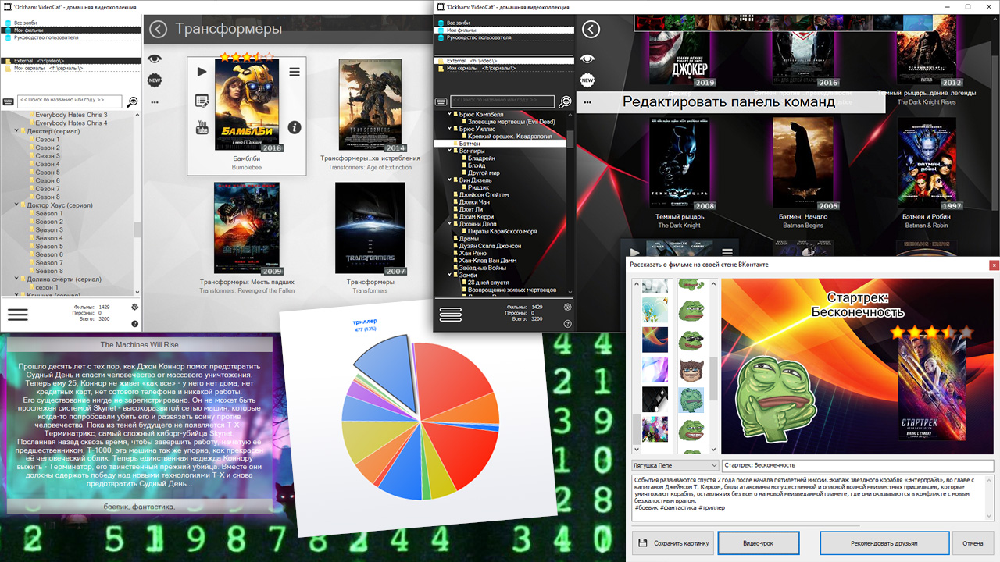

# Ockham:Videocat

Домашняя страница: [videocat.maagames.ru](https://videocat.maagames.ru/)

Подержка: :heavy_dollar_sign: [donate](https://videocat.maagames.ru/purchase.html)

Буду краток...

Я создавал этот каталогизатор под личные нужды, потому что ни один из имеющихся каталогизаторов не устраивал меня ни функционалом, ни внешним видом.

Я начал разработку в 2015 году. Первый коммит был сделат 1 мая 2015 года в 17 часов 18 минут. За годы разработки каталогизатор превратился из расширения файлового менеджера в полноценный каталогизатор. Вместо простой всплывающей подсказки над видеофайлом в эксплорэре появилась отдельная программа с постерами, кадрами фильмов, поискам по тегам и многим другим... За годы разработки было добавлено много функционала по запросам пользователей, а каталогизатор обрёл небольшую базу верных пользователей. Однако, я не смог монетизировать проект. А что происходит с проектом, который делается только на личном энтузиазме, уже полностью реализует все хотелки создателя и, при этом, приносит только убытки? Правильно, проект начинает стагнировать и умирает, так как нет стимула продолжать его разработку.

Я всё ещё поддерживаю проект в актуальном состоянии, но события последних лет показали, что произойти может что угодно, а мне не хочется, чтобы мои многолетние труды над проектом Ockham:Videocat канули в лету, если со мной что-то случится или я просто его заброшу. Поэтому я решил опубликовать исходный код, вдруг он пригодится кому-то ещё, помимо меня. В далёком-далёком будущем :D

У меня есть планы по созданию второй версии каталогизатора, но он будет с совершенно иной внутренней архитектурой, чтобы решить концептуальные проблемы, имеющиеся у версии 1. Некоторые из идей, которые хотелось бы сделать и некоторые из пожеланий пользователей или невозможно сделать принципиально или требуют слишком большой переделки архитектуры, поэтому я просто отказывался от этих идей. Например, т.к. идентификатор файла связан с относительным путем к файлу/папке, то невозможно отличить одноимённые папки на разных внешних или сетевых дисках. Это связано с первоначальной концепцией каталогизатора, выбранной мной в далёком 2015 году, когда у меня не было ни множества внешних, ни сетевых дисков и я просто не подумал о потенциальной возможности такой проблемы. Есть и другие нюансы, о которых я не подумал в 2015 году, а сейчас они вызывают сложности... Плюс я хочу избавиться от MFC и использовать  Qt, это позволит сделать каталогизатор кроссплатформенным.

Но тут опять встаёт вопрос о том, что нет стимула этим заниматься, помимо любви к программированию. Как монетизировать каталогизатор я так и не придумал. А после роста скоростей интернета и появления множества онлайн-кинотеатров смысл хранения фильмов на своём ПК сильно снизился и необходимость каталогизаторов фильмов пропала. Интеграцию с торент-клиентами я так и не доделал, а обычным пользователям в современном всегда-онлайн мире каталогизаторы больше не нужны...

Так сказать, пользуйтесь на здоровье. Надеюсь, кому-то код будет полезен, хотя бы в учебных целях в качестве примера того, как можно.
